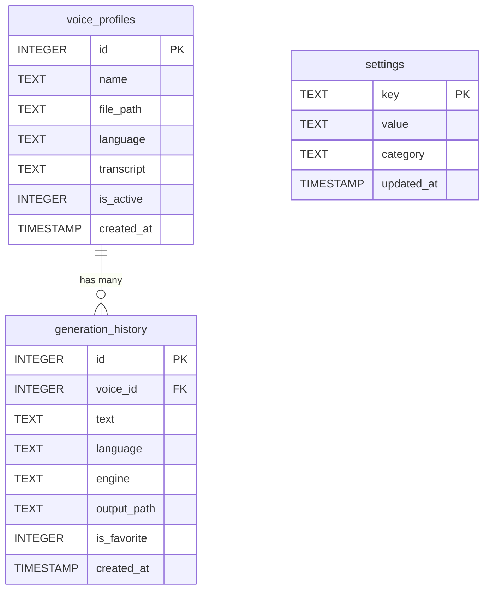

# AI Voice Clone Studio — Database Design & Schema

This document details the complete database design for the AI Voice Clone Studio. 

The application uses **SQLite** (via the `aiosqlite` async driver in Python). SQLite is a serverless, local database that stores all data in a single file on your hard drive, ensuring 100% privacy and offline capability.

## Graphical Representation (ER Diagram)

The following Mermaid diagram illustrates the relationships between the core tables in the system:

---

## Table Definitions

### 1. `voice_profiles`
Stores metadata and file locations for all cloned voices that the user records or uploads.

| Column | Type | Constraints | Description |
|--------|------|-------------|-------------|
| `id` | INTEGER | PRIMARY KEY, AUTOINCREMENT | Unique identifier for the voice. |
| `name` | TEXT | NOT NULL | The user-provided name of the voice (e.g., "My Voice", "John Doe"). |
| `file_path` | TEXT | NOT NULL | Absolute or relative path to the `.webm` or `.wav` audio file on disk. |
| `language` | TEXT | DEFAULT 'en' | The primary language spoken in the reference audio. |
| `transcript` | TEXT | NULLABLE | An optional transcript of what is being spoken in the reference audio (helps certain AI models). |
| `is_active` | INTEGER | DEFAULT 1 | Boolean (1 or 0) indicating if the profile is visible in the UI. Used for soft-deletion. |
| `created_at` | TIMESTAMP | DEFAULT CURRENT_TIMESTAMP | When the profile was uploaded/recorded. |

---

### 2. `generation_history`
Acts as the gallery/history table. Every time the user clicks "Generate Speech", a new record is saved here pointing to the resulting audio file.

| Column | Type | Constraints | Description |
|--------|------|-------------|-------------|
| `id` | INTEGER | PRIMARY KEY, AUTOINCREMENT | Unique identifier for the generation event. |
| `voice_id` | INTEGER | FOREIGN KEY | References `voice_profiles(id)`. Identifies which voice was cloned. |
| `text` | TEXT | NOT NULL | The actual text that was converted into speech. |
| `language` | TEXT | NOT NULL | The target language for the generated speech. |
| `engine` | TEXT | NOT NULL | The AI model used (e.g., "mock", "f5-tts", "fish-speech"). |
| `output_path` | TEXT | NOT NULL | The disk path to the generated `.wav` file. |
| `is_favorite` | INTEGER | DEFAULT 0 | Boolean (1 or 0). Allows the user to "star" or favorite specific generations in the UI. |
| `created_at` | TIMESTAMP | DEFAULT CURRENT_TIMESTAMP | When the generation occurred. |

---

### 3. `settings`
A simple key-value store for global application preferences.

| Column | Type | Constraints | Description |
|--------|------|-------------|-------------|
| `key` | TEXT | PRIMARY KEY | The setting name (e.g., "default_engine"). |
| `value` | TEXT | NOT NULL | The string value of the setting. |
| `category` | TEXT | NOT NULL | Used to group settings in the UI (e.g., "system", "ai"). |
| `updated_at` | TIMESTAMP | DEFAULT CURRENT_TIMESTAMP | When the setting was last changed. |

## Data Storage Location

Because you are running the app as a compiled Tauri desktop application, the `.exe` currently spins up its working directory in your Windows Temp folder. 

Your database and audio files are safely stored offline on your hard drive here:
`C:\Users\iamif\AppData\Local\Temp\data\`
- `db/voiceclone.db` (The SQLite database file)
- `voices/` (Your microphone recordings)
- `history/` (Your generated speech clips)

*(Note: When you prepare this app for a professional release on your RTX 4060, the backend Python code should be updated to point to a permanent directory like `C:\Users\iamif\AppData\Roaming\VoiceCloneStudio\data` so the data persists across reboots).*
